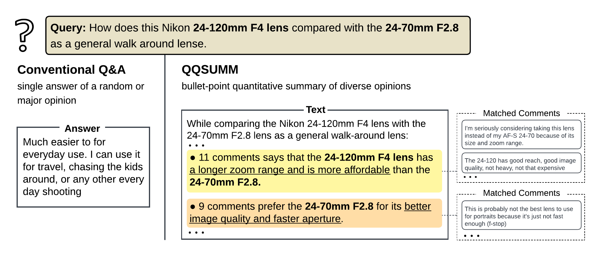
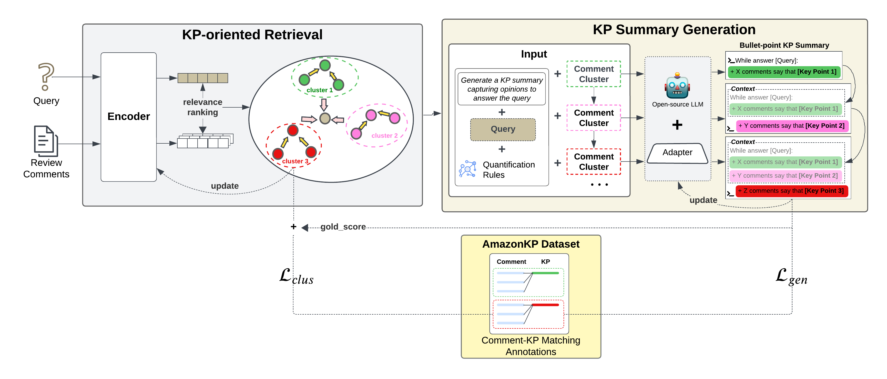
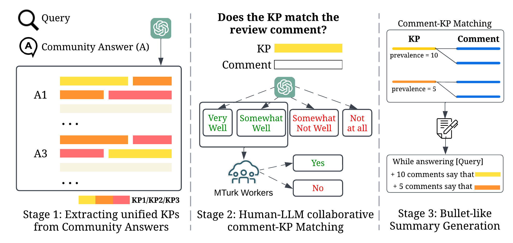

<div align="center">

# QQSUM: Query-Focus Quantitative Summarization

</div>

This repository maintains the code, data, and model checkpoints for the paper *QQSUM: A Novel Task and Model of Quantitative Query-Focused Summarization for Review-based Product Question Answering*

We explored a new task, Quantitative Query-Focused Summarization (QQSUM), to generate comprehensive answers capturing diverse viewpoints along with their prevalence for review-based product question answering.



[//]: # (# Code to release soon.)

## Installation
Our code is developed based on the [Atlas](https://github.com/facebookresearch/atlas) codebase.
Our model was tested under the following dependencies
- python 3 (tested with 3.9)
- fairscale (tested with 0.4.6)
- transformers (tested with 4.44.2)
- faiss (tested with 1.8.0)

We recommend installing using conda and GPU for reasonable runtime. The following will install all dependencies, referenced from Atlas:
```bash
conda create --name atlas-env python=3.9
conda activate qqsum
conda install pytorch pytorch-cuda=11.8 -c pytorch -c nvidia
conda install -c pytorch faiss-gpu=1.8.0
```

[//]: # (It is recommended to set up the environment and install required libraries using conda. )
[//]: # (It is also recommended that the machine should have GPUs to perform inference at a reasonable time.  )
[//]: # (Please  to the Atlas repo for setup instruction.)

[//]: # (### 3. Additional packages)
We also need some additional packages to run the code. The list of packages is listed in ```requirements.txt```. On the main directory of the repository, run:
```bash
pip install -r requirements.txt
```

Built upon [Atlas](https://github.com/facebookresearch/atlas) as the backbone model, our model requires the Atlas pretrained checkpoints.
Before training or inference, you must run the following command to download the pre-trained Atlas model, which include both the pretrained retriever and reader weights. 
```bash
python preprocessing/download_model.py --model models/atlas/xl --output_directory ./checkpoints
```

This will download the requested model to the ```/checkpoints``` directory.

## The QQSUM-RAG Model




### Model Checkpoint


### Training

### Inference

### Model Performance

[//]: # (## QQSUM: Task Introduction)

## The AmazonKP Dataset
We proposed AmazonKP, a new dataset specialized for training and evaluating models for the QQSUM task. 
The dataset can be accessed under the ``data``/ folder.
Files in each folder:
* ```.pkl```: data in .pkl format, accessible via Pandas library.
* ```.csv```: data in .csv format.
* ```.jsonl```: data in .jsonl format (only for Yelp raw data).

AmazonKP is curated based on a three-stage human-LLM collaborative annotation pipeline.
Additionally, we provide the code for reproducing the curation of AmazonKP, which consists of 3 stages


- **Stage 1:** Extracting key points (KPs) from gold community answer. We provided the code for prompting LLM to extract KPs from gold community answer in ...
- **Stage 2:** LLM-based and Manual Comment-KP Matching. We provided the code for prompting LLM to perform comment-KP Matching in  ...
- **Stage 3:** KP-based Summary
