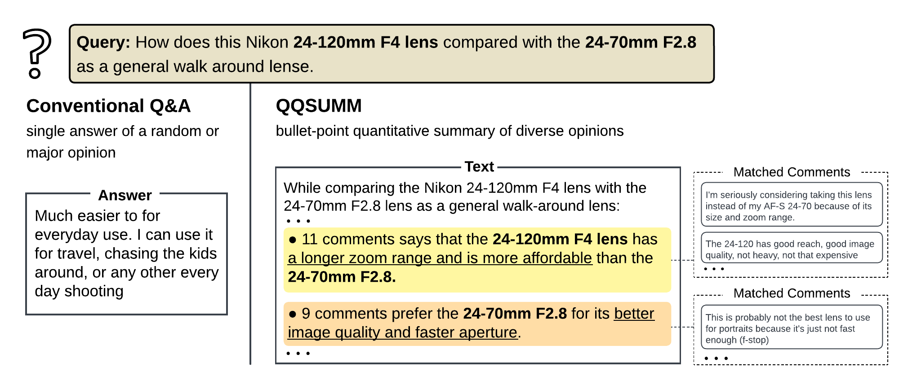
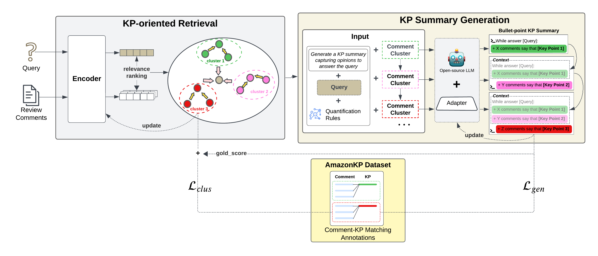

<div align="center">

# QQSUM: Query-Focus Quantitative Summarization

</div>

This repository maintains the code, data, and model checkpoints for the paper *QQSUM: A Novel Task and Model of Quantitative Query-Focused Summarization for Review-based Product Question Answering*

We explored a new task, Quantitative Query-Focused Summarization (QQSUM), to generate comprehensive answers capturing diverse viewpoints along with their prevalence for review-based product question answering.



[//]: # (# Code to release soon.)

## Installation
Our code is developed based on the [Atlas](https://github.com/facebookresearch/atlas) codebase.
Our model was tested under the following dependencies
- python 3 (tested with 3.9)
- fairscale (tested with 0.4.6)
- transformers (tested with 4.44.2)
- faiss (tested with 1.8.0)

We recommend installing using conda and GPU for reasonable runtime. The following will install all dependencies, referenced from Atlas:
```bash
conda create --name atlas-env python=3.9
conda activate qqsum
conda install pytorch pytorch-cuda=11.8 -c pytorch -c nvidia
conda install -c pytorch faiss-gpu=1.8.0
 conda install -c conda-forge importlib_resources
```

[//]: # (It is recommended to set up the environment and install required libraries using conda. )
[//]: # (It is also recommended that the machine should have GPUs to perform inference at a reasonable time.  )
[//]: # (Please  to the Atlas repo for setup instruction.)

[//]: # (### 3. Additional packages)
We also need some additional packages to run the code. The list of packages is listed in ```requirements.txt```. On the main directory of the repository, run:
```bash
pip install -r requirements.txt
python -m spacy download en_core_web_sm
python -m spacy download en_core_web_lg
cd evaluation/AlignScore
pip install .
```

[//]: # (Built upon [Atlas]&#40;https://github.com/facebookresearch/atlas&#41; as the backbone model, )
Our model requires the [```atlas-xl```](https://github.com/facebookresearch/atlas?tab=readme-ov-file#models) pretrained checkpoints.
Before training or inference, you must run the following command to download the pre-trained Atlas model, which include both the pretrained retriever and reader weights. 
```bash
python preprocessing/download_model.py --model models/atlas/xl --output_directory ./checkpoints
```

This will download the requested model to the ```/checkpoints``` directory.

## The QQSUM-RAG Model
We propose an end-to-end Retrieval Augmented Generation (RAG) model, namely QQSUM-RAG, for the QQSUM task.
QQSUM-RAG extends RAG, employs few-shot learning to jointly train a KP-oriented retriever and a KP summary generator, enabling KP-based summaries that capture diverse and representative opinions in the answer.
The below figure illustrates PAKPA framework with examples.
Given an online user query on a product, QQSUM-RAG retrieves query-relevant comments from product reviews, clusters them by distinct opinions, and summarizes representative KPs from each cluster.
QQSUM-RAG consists of two components/stages: 
- **Stage 1: KP-Oriented Retrieval**: utilizes a Retriever to retrieve and cluster query-relevant comments into groups
- **Stage 2: KP Summary Generation**: utilize  LLM to generate the final KP summary based on the comment clusters



### Training
To train QQSUM-RAG with default hyperparameters and settings mentioned in the paper, run the following command:
```
sh train.sh
```

The training procedure first warms up the LM with the generation task, before performing the full training, 
which co-trains the Retriever and the LM with sharable supervision signal.
You can also customize the hyperparameters and data directory by checking the file [```options.py```](/src/options.py).
After successful training, the model checkpoints will be saved at ```/exps/atlas-xl-seed2-lgret-lglm```

All prompts are located under [```/prompts```](/prompts)

### Model Checkpoint
For ease of reproducibility, we provided the trained model checkpoints of QQSUM-RAG, using Mistral-7B as the LLM for KP Summary Generation.
Model checkpoint can be downloaded from this [Google Drive link](https://drive.google.com/file/d/1M6JY0Cs3EG6N34S6mWAMpK3wX6TVF4UX/view?usp=sharing).
Please download the file and unzip the ```/exps``` directory into the main working directory.

### Inference
[//]: # (We offer two options to perform inference of our QQSUM-RAG model, using Jupyter Notebook files &#40;```notebook```&#41; or Python inference scripts &#40;```script```&#41;. )
To perform inference of QQSUM-RAG with default hyperparameters and settings mentioned in the paper, run the following command:
```
sh inference.sh
```
The inference output file will be saved under [```/output/atlas-xl-seed2-lgret-lglm/test-result.jsonl```](/output/atlas-xl-seed2-lgret-lglm/test-result.jsonl)

### Evaluation & Performance

[//]: # (## QQSUM: Task Introduction)

Codes for reproducing our experiments and evaluations is located in the [```/evaluation```](/evaluation) directory.

**File description:**

#### KP Quality Evaluation #### 
* ```KP_Quality_Evaluation_sP_sR_sF1.ipynb```: Perform sP/sR/sF1 set-level evaluation of individual generated KPs with reference KPs 
(extracted from gold community answer - Stage 1 of AmazonKP curation).
* ```KP_Quality_Evaluation_RD.ipynb```: Perform Redundancy (RD) evaluation among individual generated KPs 

#### KP Quantification Evaluation ####
* ```KP_Quantification_Evaluation_Matching.ipynb```: Perform comment-KP matching to measure the matching *precision* (correctness of predicted matches) and *recall* (coverage of ground-truth matches) of generated KPs and comments in their respective clusters. 
* ```KP_Quantification_Evaluation_Factual_Alignment.txt```: Perform factual alignment evaluation between generated KPs and comments in their respective clusters.

[//]: # (Assess the accuracy of the KP comment matching, i.e., how well comments are matched to KPs, by measuring precision &#40;correctness of predicted matches&#41; and recall &#40;coverage of ground-truth matches&#41;)

## The AmazonKP Dataset
We proposed AmazonKP, a new dataset specialized for training and evaluating models for the QQSUM task.
The dataset can be accessed under the [```data/```](/data) folder, 
following the [```train/```](/data/train) and [```test/```](/data/test) subdirectories for the train and test set.

Files in each sub-directory:
```
data
├── train
│   ├── train.jsonl
│   ├── copora
│       ├── input_reviews.jsonl
│       ├── gold_comment_clusters.jsonl
│       ├── gold_retrieved_comments.jsonl
├── test
│   ├── test.jsonl
│   ├── copora
│       ├── input_reviews.jsonl
├── full
│   ├── amazon_kp_dataset.jsonl
│   ├── amazon_kp_dataset.csv
│   ├── amazon_kp_dataset.pkl
```

File description:
* ```train.jsonl``` or ```test.jsonl``` : Input data file containing the input question, i.e., query, and the final key point (KP) summary ground truth. 
* ```input_reviews.jsonl```: Complementary input product review comments of questions in  ```train.jsonl``` or ```test.jsonl```
* ```gold_comment_clusters.jsonl```: Clusters of comments formed by comment-KP matching annotation (Stage 2)
* ```gold_retrieved_comments.jsonl```: query-relevant comments aggregated from annotated clusters

*NOTE: For training or evaluating QQSUM-RAG on your own dataset instead of AmazonKP, please make sure to follow the data format and structure given in the above `jsonl` files*

