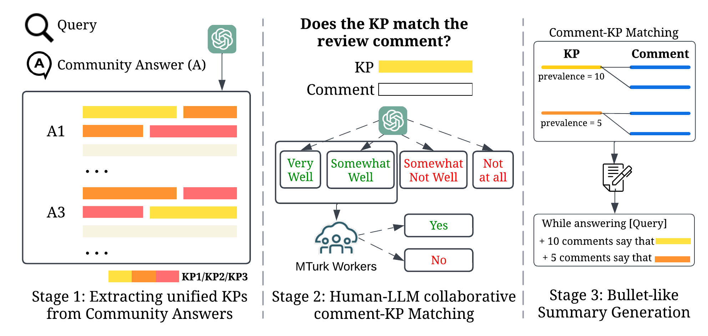

[//]: # (## The AmazonKP Dataset)
[//]: # (```)
[//]: # (├── corpus)
[//]: # (│   ├── docs.jsonl)
[//]: # (│   ├── docs_test_full.jsonl)
[//]: # (│   ├── fc_articles.json)
[//]: # (│   ├── fc_clusters.with_id.json)
[//]: # (├── train.jsonl)
[//]: # (├── test.jsonl)
[//]: # (```)
[//]: # (Files in each folder:)
[//]: # (* ```.pkl```: data in .pkl format, accessible via Pandas library.)
[//]: # (* ```.csv```: data in .csv format.)
[//]: # (* ```.jsonl```: data in .jsonl format &#40;only for Yelp raw data&#41;.)

### AmazonKP Dataset Curation (optional)
AmazonKP is curated based on a three-stage human-LLM collaborative annotation pipeline.
Optionally, we provide the code for you to reproduce the curation of AmazonKP, which consists of 3 stages:



- **Stage 1:** Extracting key points (KPs) from gold community answer. We provided the code for prompting LLM to extract KPs from gold community answer in ...
- **Stage 2:** LLM-based and Manual Comment-KP Matching. We provided the code for prompting LLM to perform comment-KP Matching in  ...
- **Stage 3:** KP-based Summary